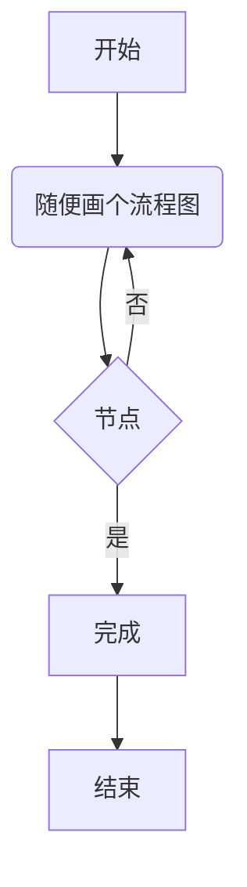
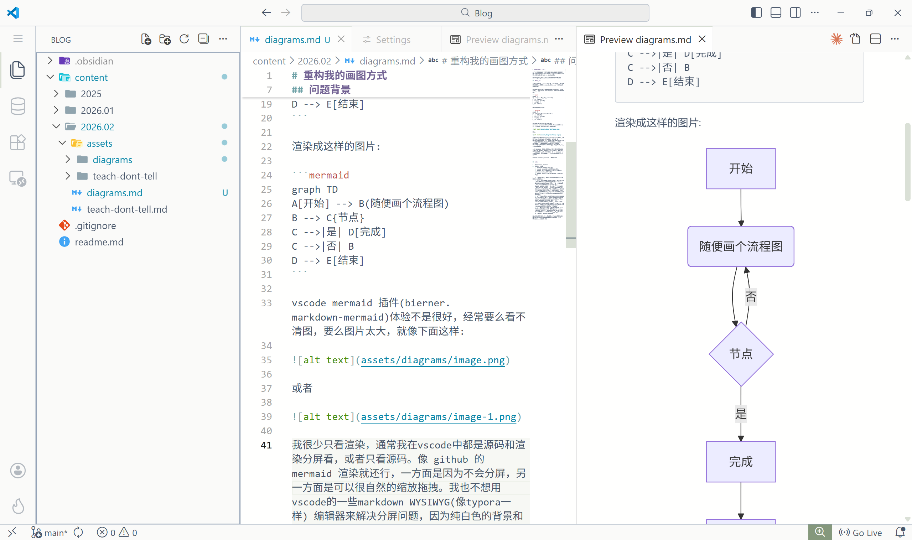
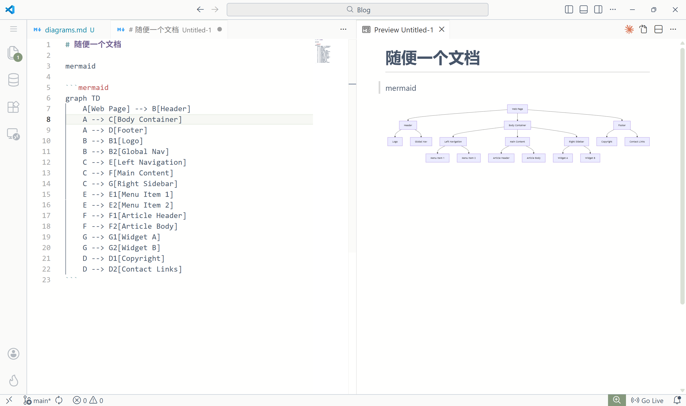
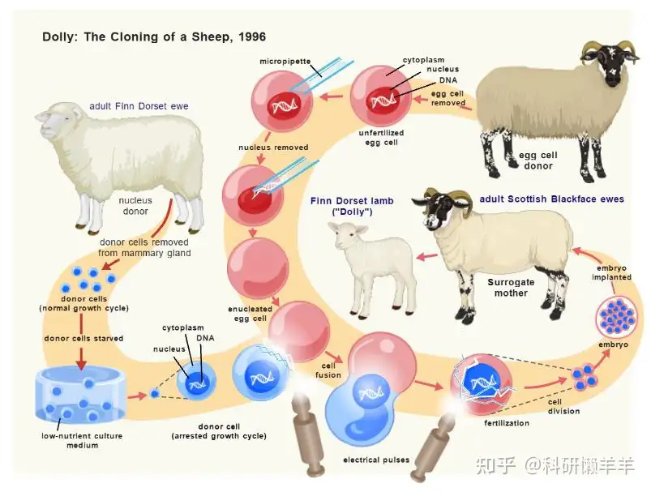
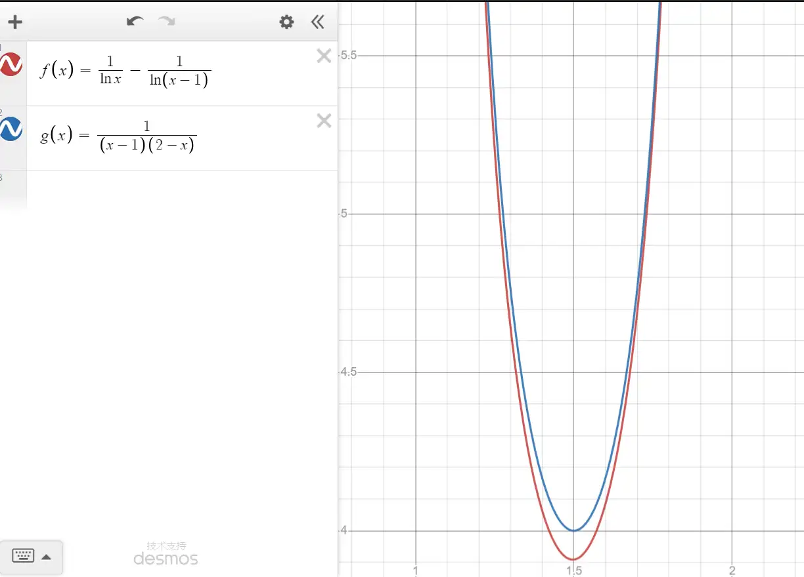
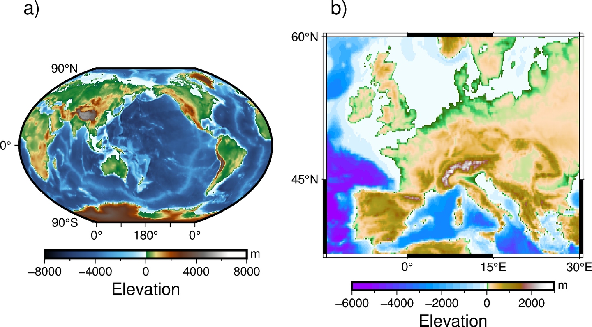

# 重构我的画图方式

画图是写文档的一部分，如果你对文档质量有讲究，就必然要对图片质量、画图方式有讲究，我平时主要用的是drawio 和 mermaid。

但是我最近对这套方案不太满意，试图重构。

## 问题背景

我最近越来越感觉画图体验很差，总结了一下发现有下面这些问题(“总结哪里体验差”是一件并不容易的事情)

先说mermaid，如果你不知道的话我可以用一个代码块和一张图介绍一下，mermaid 可以把下面的代码:

```text
graph TD
A[开始] --> B(随便画个流程图)
B --> C{节点}
C -->|是| D[完成]
C -->|否| B
D --> E[结束]
```

渲染成这样的图片:



vscode mermaid 插件(bierner.markdown-mermaid)体验不是很好，经常要么看不清图，要么图片太大，就像下面这样:



或者



我很少只看渲染，通常我在vscode中都是源码和渲染分屏看，或者只看源码。像 github 的 mermaid 渲染就还行，一方面是因为不会分屏，另一方面是可以很自然的缩放拖拽。我也不想用vscode的一些markdown WYSIWYG(像typora一样) 编辑器来解决分屏问题，因为纯白色的背景和主题很不搭。

而且 mermaid 默认主题我不是很喜欢，紫紫的。我很喜欢 drawio 的默认主题，那种有一种逻辑和形式上的干净感，而且每次用 AI 画 mermaid 画完了都要补一句设置样式继续等AI吐token，又嫌麻烦。


再来说说drawio的问题，drwaio 其实非常好，是类似 visio 一样的工具。找图片太累了我懒得找了，你可以浏览器打开在线体验一下，链接简短到没必要用超链接 https://draw.io

但是我用 drawio 画图很费时间，真不是我用的不熟，我已经是好几年的 drawio 重度用户，费时间是因为我是一个有点重逻辑、有点偏执、有点完美主义的人，我不能接受元素间隔不一致、连线不对齐等等问题，drawio是一个UI操作的画图工具，不想mermaid那样定义逻辑、程序渲染，就不用担心这些问题（当然在某些需求面前这个特点也是个局限）。也有简单一些的平替比如tldraw或者excalidraw，但是他们并没有drawio那种严谨且逻辑干净的感觉。

那能不能用 AI 画 drawio 呢？有一个叫做 [next-ai-draw-io](https://github.com/DayuanJiang/next-ai-draw-io) 的项目，项目作者自己都说很吃模型能力，我用的是最贵一档的智谱清言的 GLM，画出来效果完全没眼看，而且输出真的非常慢，还看不到绘画进度。

插个题外话，我能够理解为什么AI画不好，因为 drawio 格式本质上是定义每一个图形的绝对位置的 xml，首先 xml 这个格式本身在语义上就是一坨，其次你就算让人类光看文本不看图，只根据绝对位置去画图也是很难画好的。你需要图像的视觉反馈才能画下去，你要么需要程序帮你渲染成图像，要么自己大脑渲染。我之前做过一个让AI把pdf处理成markdown的工具，我发现把 pdf 渲染成图片之后给AI看，再辅以一些从pdf抽取文字和图像的工具，效果会好很多，我的意思是AI和人一样如果能有视觉上的反馈，工作效果会好很多，感觉这个应用似乎并没有尝试让AI获取视觉反馈，纯靠AI的模型能力强行推理图像的坐标位置关系。

## 探索

有些需求和要点，需要你自己探索过才知道。经过我和gemeni的一阵battle，我发现挑选工具有以下关键点：

首先是我要选择 drawio 这样的 GUI 画图，还是 mermaid 这样代码渲染图片？我选择后者，因为 drwaio 几乎是前者的天花板。（同样 mermaid 也几乎是后者的天花板）

还有一个要点是不同领域不同场景画的图是不一样的，比如这是生物领域的:



数学上的一般是画函数图像



地理绘图就更不一样:


我是一个开发者，我只考虑软件工程，一般是架构图、流程图、时序图，其实mermaid都能满足，我只是嫌弃用起来不太方便。

我在和朋友交流的时候，都在推荐 typst，但 typst 到底还是一个文档排版工具，我的需求是画图，虽然他也有一定能力，但我觉得这么做并不合适。

最后这个语言必须要是AI友好的，不能像drawio那样绝对定位，而是要相对定位。

## 尝试 pikchr

最后我比较看好的是pikchr，发音同picture，这是sqlite作者专门为sqlite文档创造的一个绘图语言，像这样:
```pikchr
box "element" bold fit
line down 50% from last box.sw
dot rad 250% color black
X0: last.e + (0.3,0)
arrow from last dot to X0
move right 3.9in
box wid 5% ht 25% fill black
X9: last.w - (0.3,0)
arrow from X9 to last box.w

box "object-definition" italic fit at 11/16 way between X0 and X9
arrow to X9
arrow from X0 to last box.w
```

渲染出来是一个像这样的svg


我对它的图像风格和代码的可读性都很满意, 但问题是AI画不好，因为它太小众了，我用网页版的gemeni和claude code + GLM都需要迭代几次才能解决语法错误，画 mermaid 只会偶尔出现错误。我尝试添加 pikchr skills，也同样无效。

## 最后

最后我决定还是继续用 mermaid，我继续探索 mermaid，经过一些妥协，我使用 mermaid 的体验提升了一些:

画风方面，mermaid 可以设置主题改变风格，我觉得 neutral 要比紫色好一些，实在不行就多说一句提示词，让AI改一下样式。

vscode的mermaid插件方面，我探索了之后才知道，这个插件是可以设置默认打开拖拽的(原本需要点一下按钮才能开始拖拽)，而且也可以用alt缩放会舒服一些，其实我更习惯ctrl但是这个插件用ctrl缩放会倍率很高，而且没法改设置。

那就这样凑合用吧。
