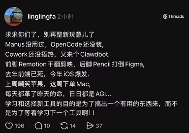

# AI把执行成本降到无限低，我才发现自己根本不会决策

当AI代替我去执行，而我只需负责重要决策时，我才发现自己的判断、决策和直觉竟如此笨拙。我的决策质量之低，让我深受打击。

这篇文章我想聊聊关于“氛围编程”（vibe coding）的观察、实际体验和社区讨论。遗憾的是，我只能转述和分享，真正属于我的东西很少——我只是在信息传播链上比一些人靠前而已。这并非因为我有什么特殊的信息源或独家渠道，仅仅是因为我对这个话题感兴趣，所以花了更多时间收集社区动态。

## 过去几年我看到了什么

AI的热潮始于2022年底的ChatGPT 3.5。那时，国内不少开发者靠信息转发赚钱——搭建一个国内可访问的网站，把用户问题转发给ChatGPT。如今到了2026年，仍有很多人在做类似的事，只是他们已发展成“AI网关”，提供统一的模型接口和更精细的成本控制。

2023和2024年，我对AI发展的感知主要来自AI绘画领域，因为绘画圈对AI的抵制非常激烈，很难不注意到。发展到如今的多媒体AI，已是百花齐放：只用AI生成画面和音频，就能制作出客观质量惊人的视频，可以参考这个作品 [牌子 - bilibili](https://www.bilibili.com/video/BV11mFLziEyP)。

2024年底，之前的Devin、Copilot、Manus并没有引起我太多关注，说实话，它们的炒作性质大于实用性。直到“Cursor”像核弹一样炸开，一场Coding Agent的军备竞赛轰轰烈烈地持续了整个2025年。上半年是Cursor和Claude Sonnet 3.7二分天下；年中更是百家争鸣：Claude Sonnet/Opus 4.1、Gemini 2.5、Codex（具体版本记不清了）……一轮激烈竞争后，厂商开始大规模控制成本，Cursor调整价格策略，一众模型出现“降智”。随后国产模型跟进战场，GLM 4.5、Minimax、Kimi等，相比国外模型，它们的特点是质量及格、性价比极高。如今到了2026年2月，市场格局已逐渐明朗：在最贵档位的Coding Agent争夺中，Codex略输Claude一筹，转而关注下沉市场，甚至开放免费使用。中等价位领域，Codex和Claude难分伯仲；低价位则基本是国产模型的天下，不过Codex也开始争夺下沉市场，未来还不好说。

## 我感受到了什么

**首先是宏观层面**，我的观点可能比较肤浅，毕竟我并不擅长这方面。我听说美国的模型大厂为了训练模型甚至需要自建核电站，这在中国是难以想象的。这也说明，要产出更好的模型，不仅需要敢为人先的创新和天才算法，物理世界的供给同样关键。而中国正在搭建国家级的算力网络，在这方面或许会形成优势。

**第二是关于社区——社区的浮躁正在蔓延**。最早是Devin和Manus，它们给投资者画了一张大饼。虽然当时有些出圈，但开源社区并没有太大波澜。可现在，开源社区也出现了一些不太好的现象，下面这张图或许可以概括：

我个人不太喜欢OpenClaw这个项目，因为它被严重高估，并且是借助社区情绪才获得了那么多Star。实际上很多人部署后发现，它并没有什么实际使用场景，而且被曝出过不少严重的安全问题。这种情绪主要来自“害怕错过机会的焦虑”，英文里有个专门的词：FOMO（Fear of Missing Out）。

这也让我接受了一个事实：开源社区的开发者并不比其他社交平台的用户、投资市场上的散户更冷静、更理性。很多时候，只是因为他们利益不相关而已。

**第三是关于开发者的素质与个人能力**。当AI代替我去执行，而我只需负责重要决策时，我才发现自己的判断、决策和直觉竟如此笨拙。我的决策质量之低，让我深受打击。

最初，AI只用于自动补全，那时我们是“监工”；后来可以用界面对话、让AI写代码片段，我们成了“指挥官”；到了现在的Agentic Workflow，我们只需要提出需求和做关键决策。这个过程中，我们的身份就像从基层开发，到小组长，再到技术负责人，不同高度需要关注的问题完全不同：

| AI 核心能力         | 开发者核心工作       | 开发者身份   | 关注层面                     | 核心素质                     |
|---------------------|---------------------|-------------|-----------------------------|-----------------------------|
| 单点自动补全        | 语法修正与补全      | 基层开发    | 语法与实现细节：代码能跑通吗？命名规范吗？ | 熟悉语法、勤奋、注重代码风格 |
| 对话式代码生成      | 需求拆解与模块组装  | 小组长      | 模块逻辑与接口：函数输入输出对吗？边界处理了吗？ | 模块拆解能力、Prompt工程、代码审查 |
| Agentic Workflow    | 系统定义与演进      | 技术负责人  | 架构设计与业务本质：方案可扩展吗？技术选型符合业务目标吗？ | 系统思维、风险预判、全局观 |

问题的关键在于，我从来没有做过技术负责人，也没有相关经验。我根本做不好——甚至做得不如AI。
