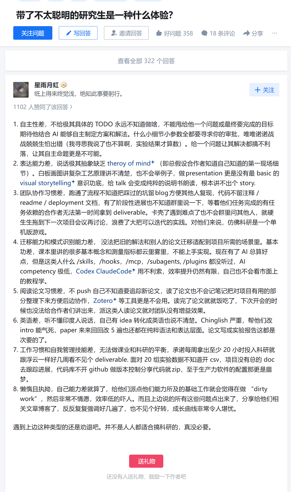

# 通用素质

原文是知乎的这个问题下的一个高赞回答 [带了不太聪明的研究生是一种什么体验？](https://www.zhihu.com/question/438993114/answer/2040944706545312085)

最让我挥之不去的是 “卡壳了遇到难点了也不会群里问其他人，就硬生生拖到下一次项目会议再讨论，浪费了大把可以迭代的实践。” 骂到我心里去了，希望以后回顾这篇博客的时候我会有所进步。

> 2026年8月20日注，这些问题已经基本不会在我身上出现。
