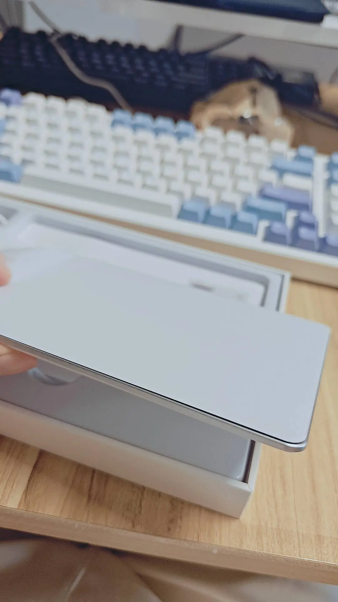

# 外置触摸板和人机交互

外置触摸板的体验让我思考了操作系统的输入哲学，从键盘，到鼠标，到AI。

---

2026年6月30日，我买的外置触摸板到了，是国产的一个玻璃面板的触摸板，除了玻璃的似乎还有金属等其他材质的。

单说触摸板，这个触摸板比游戏本的要好很多，但是距离 MacBook 的触摸板也有些差距。在我买之前朋友就劝我说触摸板只能买苹果的妙控板，但是苹果妙控板太贵了，自己用了才发现朋友所言不虚。但是让我退货的不只是国产触摸板和苹果妙控板的差距，而是触摸板和鼠标的差距。

从使用效果上来讲，触摸板比鼠标更容易切换（无论是外置触摸板还是笔记本自带的触摸板），但是触摸板的操控精准度不如鼠标。**这看起来是鼠标和触摸板的对比，实际上我觉得关键在于键盘。** 

由于触摸板没有那么好用，你需要把更多的输入操作交给键盘，更多的使用命令和快捷键；而有鼠标的情况下我会更倾向于多用鼠标，这造成了我的右手食指压力（也是我想尝试触摸板的直接原因），可是我不用触摸板的情况下也可以多用键盘，发现了这一点之后我就退货了。

另外我一直都不理解为什么很多人喜欢平铺式窗口管理器，现在知道原来是因为它在 “无鼠标、少鼠标” 场景下很有用。

## 输入和交互哲学

上升到哲学的角度，我们可以发现从键盘到鼠标到触屏的输入设备变化，以及到最新的还有 AI 交互 —— 也就是以后的UI界面是否全都会变成一个AI聊天框的话题（答案当然是不会）。

从时间角度讲，这些交互方式的出场顺序是 键盘 => 鼠标/触摸板/小红点 等等 => 触屏 => AI。

把他们抽象一层，关键的是背后交互逻辑的迭代更新（有意义的是他们的迭代更新，而不是比较拉踩）。我们以键盘逻辑为基准，它是基于快捷键和指令的，也就是说这是一种命令式的输入。

而 GUI + 指针（也包括触控）相比前者，主要的优化在于信息获取更方便，以及“维护状态”的压力被转移，我会分别解释。信息获取方便很好理解，GUI 的界面比 TUI 和 CLI 都丰富很多，信息获取效率明显提升。

“维护状态”的压力被转移，这句话我们以 git 来举例说明。如果你在纯终端使用git，哪些文件modified、哪些文件是untracked，这信息你要么在大脑里维护这些状态，要么用git status去显式的查询，而开发和设计 GUI 应用的时候，一个重要问题就是GUI如何维护数据和UI的状态同步，GUI 开发者需要替用户承担维护状态的心智负担，在界面上会主动为modified和untracked的文件显示不同的颜色。

当然 GUI 并非全是优点，复杂的鼠标操作在我看来是一种倒退，比如 Word 和 Photoshop 的复杂菜单栏的交互并不友好，如果做成命令操作会好很多；而正面的例子就是 Obsidian 和 vscode，他们不仅在GUI内置了命令面板，还都支持外置的终端CLI。

所以可以看到 GUI 并不是对 CLI 的全面升级，而是增强了信息获取和状态维护这两方面，在“执行操作” 方面，GUI 和 CLI 各有优劣。 **AI 同样也不应该全面覆盖 GUI 和 CLI —— 这会让你的输入输出都充满幻觉 —— 正确的使用AI的方式必然是对现有人机交互方式的增强，而不能是覆盖。这是我纯聊天框 vibe coding 几个月之后得出的经验，还是要review，不然会活在幻觉里。**

## 新的 AI 工具

经过简单的试用之后，我打算从 opencode 切换到 codex，放弃了自己开发一个新的 Harness。

曾经我也一直用Claude Code，我平时是不那么注重自由和隐私的用户，但是由于 Anthropic 这个公司许多操作实在是过于不知廉耻，我不相信他的Claude Code是安全的（以前的AGENTS.md事件，以及最近爆出的Claude Code中转站事件，都印证了我的看法），所以才迁移到了opencode，说实话opencode没有Claude code好用。

codex 相比 opencode 有更大的生态支持，所以更能做到增强交互，而不是完全代替，因为 opencode 的优势只在于他有一个做的还可以的 webui，而这实际上是代替的路线。

## 苹果妙控板和窗口管理器

2026年7月7日上午，我的苹果妙控板到了，外观跟上面差不多就不截图了。妙控板在 Windows 上使用的话，要让 codex 帮你装一个 AppleBootCamp，这个是apple官方开发的给以前的intel mac 用的驱动。

装上驱动之后你就可以通过Windows的设置 => 蓝牙和其他设备 => 触控板 来调整了。

另外由于对指针的掌控力降低，我觉得把鼠标指针放大会更舒服一些，我一开始尝试换指针样式，但是乱七八糟的指针看着不舒服，最后发现可以直接在Windows设置=>辅助功能=>鼠标指针与触控 这个地方单纯的放大指针。

---

妙控板的精髓就在于要搭配窗口管理器使用，Windows的窗口管理非常依赖于鼠标的高精度控制和频繁左键点击，如果换了触摸板还要继续这样控制窗口就会感觉再好用的触摸板也不如鼠标，如同让洗衣机去洗碗一样不合适，正确的用法应该是多用三指切换workspace，每个workspace内控制在一两个窗口，workspace内就不要老是拖动窗口了。

由于我的使用习惯成分复杂，我考虑开发一个自己的窗口管理工具：

1. alt+q 当前窗口结束进程（来自macbook的习惯
2. alt+w 关闭窗口（来自mac，这个逻辑相当于点击Windows右上角的退出，可能会结束进程，也可能会最小化到托盘）
3. alt+tab 在 workspace 内切窗口，mac 和 win 都有，吐槽一下mac在这个功能上，她的cmd+tab会显示所有的app，但是如果该app不在当前workspace，想要切到这个app的时候macos就会装死，那你就不应该显示啊
4. alt+数字 精确切换到具体的 worksapce（来自 i3）
5. win+D 最小化所有窗口 —— 这个快捷键的本意是回到桌面，但是我一直当做最小化所有窗口用，而mac上并没有这个语义的快捷键，mac上的回到桌面还会显示窗口的一小部分让我感觉很不舒服

---

但是仔细思考之后我觉得只需要在 powertoy 上加一个键盘映射，alt+w映射为alt+f4，然后把触控板改成三指切换 workspace 就够用了。

