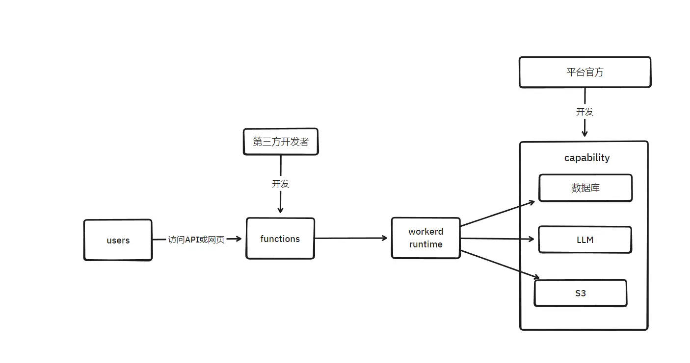

# 能否在自己服务器跑cf worker？

一个 cfworker 项目基本上能用的API只包括 ECMA + workerAPI (注意这里workerAPI和node API是同级别的概念，node的API在worker里不一定能用) + cloudflare bindings API，也就是说一个cfworker架构的项目大多数都依赖这三样东西，能不能跑就取决于这三样依赖有没有。

其中第二个依赖worker API 是worker runtime提供的，这里的 runtime 是和 node、bun、deno、浏览器同级别的概念，如果要自己运行 worker，基本上就要自己准备一个  runtime 和 bindings 去跑 worker 项目，cf 平台内相当于帮你准备好了 runtime 和 bindings。

cf 官网的 runtime 是开源的，叫做 [workerd](https://github.com/cloudflare/workerd)，而 bindings 并不开源，如果某些 worker 项目用到了某些 bindings，需要自己开发对应的 bindings 注册到 workerd 中才能运行。

也许相比改造 workerd，不如改造一下目标项目。

---

实际上 workerd 的接口是解耦出了三方参与者：
1. 官方开发 capabilities 和 workerd 本身
2. 第三方开发者开发 functions，functions运行在workerd上，functions 在运行时能够调用 capabilities
3. 普通用户能够使用部署好的 functions

