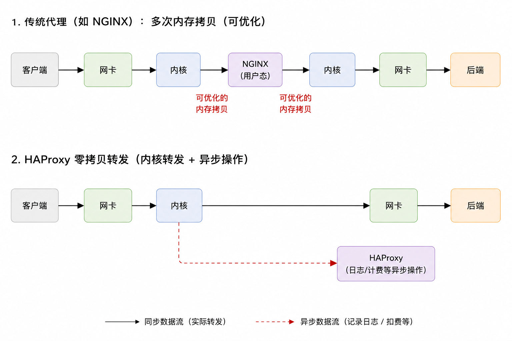
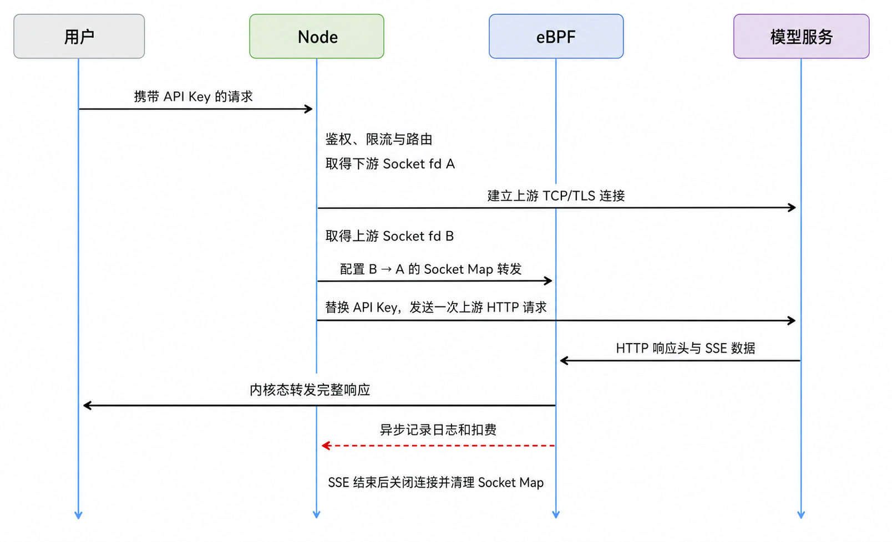
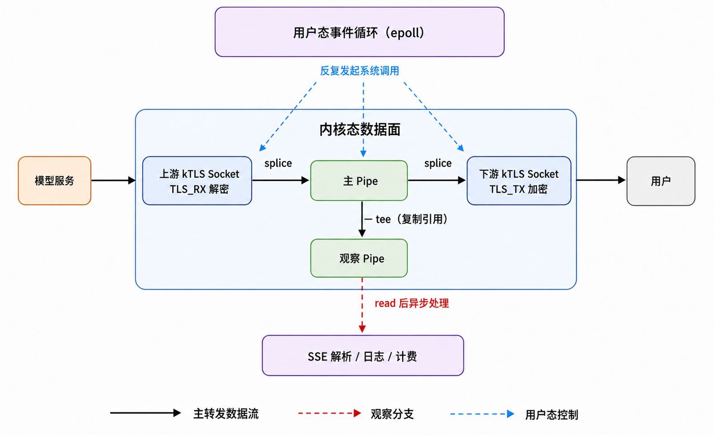
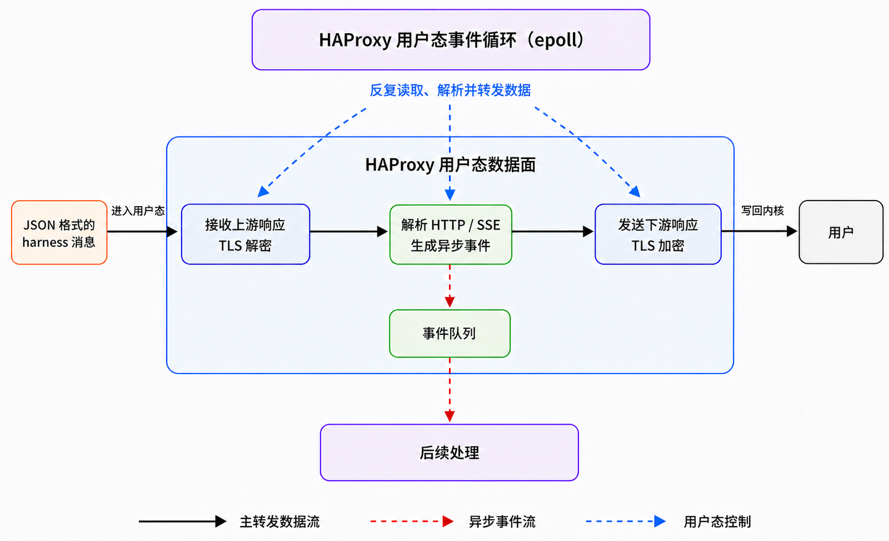
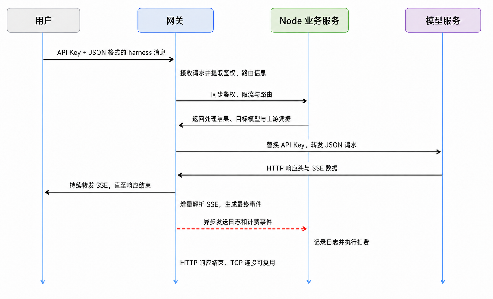

# 一次 MaaS 网关性能调研

我们最近在做一个 MaaS 平台的可行性分析，其中一个比较重要的问题是网关的性能。

一开始我们的设计比较普通。用户请求经过网关完成认证、额度检查和路由，然后由网关转发给实际的模型服务。模型返回的 streaming response 同样经过网关，再转发给用户。

这里有一个很明显的问题：认证、充值这些业务接口确实需要进入用户态处理，但是模型返回的 token 流量大部分时候只是单纯地经过网关。对于这种流量，网关实际上没有必要把数据从内核复制到自己的内存里，处理完之后再写回内核。

顺着这个问题，我们对比了一下 Nginx 和 HAProxy 的数据路径：



传统的 Nginx 转发中，数据需要从内核进入用户态，再从用户态回到内核。这里的 memory copy 不只是多占了一点内存带宽，它还需要 CPU 参与，同时会占用 CPU cache。

HAProxy 则存在另一条值得注意的数据路径：对于只需要转发的数据，可以利用 Linux 提供的内核能力，让数据尽量直接在内核中完成转发。用户态仍然可以处理连接建立、路由、日志等工作，但是不再需要为了“搬一下数据”而反复参与整个 token stream。

所以我们进一步把 MaaS 的流量拆成了两类：


认证、充值、额度查询这些业务流量还是正常进入用户态，因为我们确实需要理解和处理它们。

但是模型生成的 token 流量不一样。MaaS 在这段路径里很多时候只是一个中间人，如果不需要修改 payload，那么最理想的状态就是让它尽量直接转发，同时把日志、计量、扣费这些工作从同步的数据路径里拆出去。

这里并不是要把整个 MaaS Gateway 搬进内核，而是把“业务处理”和“单纯搬数据”拆开。

做到这里之后，又自然出现了两个问题。

**第一个问题是纵向的：如果我们真的要自己实现这样一个数据路径，Linux 到底提供了哪些能力供我们实现它？**

我们一开始接触到的是 `splice`，它允许数据在 fd 之间移动而不需要先 copy 到用户态。另外我之前也接触过 eBPF，它同样可以在 Linux 网络路径中做很多事情。继续往下看还会遇到 `sendfile`、`epoll`、`io_uring`、Socket Map、XDP、AF_XDP 等一系列机制。

这些东西看起来都和“高性能网络”有关，但是它们解决的问题其实并不一样。所以在决定具体实现之前，需要先把 Linux 这套 I/O 和网络机制弄清楚：它们最初为什么被设计出来，处在数据路径的哪一层，通常解决什么问题，以及放到 MaaS 这个场景里到底有没有意义。

**第二个问题是横向的：除了 token 流量做成内核态转发，还能横向扩展出其他思路吗？**

一次请求还会经过 TLS、鉴权、额度检查、路由、上游连接、日志、计费等很多环节。沿着“哪些工作其实没有必要出现在同步数据路径里”这个思路继续往外看，应该还能找到其他可以优化的地方。

所以接下来其实是两条线同时往下走：一条继续研究这个内核转发路径到底应该怎么实现，另一条重新检查整个 MaaS 请求链路还有哪些可以拿掉的同步成本。

而这两条线最后又汇聚到了同一个前置问题：先把 Linux 给高性能 I/O 和网络转发提供的这些底层机制搞清楚。

## 基础心智模型

由于此前很少直接接触过 Linux 的 system call、系统机制等，这里可能要补一些常识，来搭建一个最基本的心智模型。

**epoll** 是一种针对文件描述符（fd）的 I/O 事件订阅和消费机制。应用订阅关心的 fd，之后只需等待该 fd 就绪再消费，而不需要轮询 fd。文件描述符用来抽象内核资源，比如普通文件、网络连接和管道等。

```c
int epfd = epoll_create1(0);

struct epoll_event event = {
    .events = EPOLLIN,
    .data.fd = listen_fd,
};

// 订阅 listen_fd 的可读事件
epoll_ctl(epfd, EPOLL_CTL_ADD, listen_fd, &event);

struct epoll_event events[1024];

while (1) {
    // 没有事件时线程会在这里休眠，不需要轮询 fd
    int count = epoll_wait(epfd, events, 1024, -1);

    for (int i = 0; i < count; i++) {
        int fd = events[i].data.fd;

        if (fd == listen_fd) {
            int client_fd = accept(listen_fd, NULL, NULL);

            struct epoll_event client_event = {
                .events = EPOLLIN,
                .data.fd = client_fd,
            };

            // 订阅新建网络连接的可读事件
            epoll_ctl(epfd, EPOLL_CTL_ADD, client_fd, &client_event);
        } else {
            // 消费 fd 就绪事件
            handle_request(fd);
        }
    }
}
```

**io_uring** 是内核中 I/O 操作的队列机制，它提供了两个队列，一个用于发起任务，一个用于读取任务结果。io_uring 主要提供两个作用：一是有可能通过批量处理任务队列来优化性能，二是方便统一管理 I/O 操作。

内核的 **eBPF** 机制允许用户提供一段代码在内核态运行，这样可以显著提高执行效率，但是这段代码必须经过验证器的检查，确保它是安全的，并且它能够访问的内存以及可使用的内核 API 都是受限的。

> **Socket** 是内核对网络通信端点的抽象，这种抽象并不绑定某一种具体协议，既可以用于 TCP，也可以用于 UDP。应用调用 `socket()` 在内核中创建一个 Socket，并通过调用参数指定协议族和通信类型，内核随后返回引用它的文件描述符。客户端可以调用 `connect()` 让 TCP Socket 与服务端建立连接；服务端则先通过 `bind()` 绑定本地 IP 和端口，再调用 `listen()` 把它变成监听 Socket。当连接到来时，`accept()` 会返回一个新的 Socket，原来的监听 Socket 继续等待其他连接。
>
> 连接建立后，应用通过 `send()` 和 `recv()` 向 Socket 发送和读取数据，数据实际先进入内核为该 Socket 维护的发送或接收缓冲区，再由 TCP/IP 协议栈处理。`shutdown()` 用于关闭连接的发送或接收方向，`close()` 则用于释放当前进程对 Socket 的引用。因此 Socket 并不只是一个“网络连接”，而是内核维护的通信状态、缓冲区和协议行为的集合，应用通过 fd 和上述 API 操作它。

eBPF 可以通过 **Socket Map** 实现与 `splice` 类似的功能。Map 也是一种内核资源，用户态程序通过文件描述符访问它，eBPF 程序则通过 Map 引用和内核允许的 helper 访问它。eBPF 程序的局部状态会随每次调用结束而消失，因此 Map 的一个重要作用就是在多次调用之间保存和共享状态，这些数据同时也可以被用户态程序访问。

Socket Map 是一种可以引用 Socket 的 eBPF Map。用户态程序在完成连接建立、认证和路由之后，可以将相关 Socket 放入 Socket Map，再由 eBPF 程序在 Socket 之间直接于内核态重定向消息。它与 `splice` 的区别在于，`splice` 需要用户态程序在收到 I/O 就绪通知后，主动调用 `splice` 完成每次搬运；Socket Map 则允许配置好的后续转发由 eBPF 在内核数据路径中触发，不再需要用户态程序为每次搬运反复参与。

网络包进入 Linux 后，通常会经过由以太网、IP、TCP/UDP、路由和过滤等功能共同构成的内核网络协议栈，最后才会到达 Socket。在这条路径上，**skb** 是 Socket Buffer 的缩写，对应 Linux 内核中用于表示网络包的 `struct sk_buff`。这里的 Buffer 不是简单的缓冲区的意思，实际上是类似 DTO 的数据传输模型。一个真实的网络包通常需要先在内核中建立对应的 skb，才能继续进入常规网络协议栈处理。skb 相当于网络包进入 Linux 网络协议栈的第一步。

然而，还有一个机制的执行位置比 skb 的建立更早，那就是 **XDP**。

XDP 是位于网卡驱动收包路径上的 eBPF 执行点，它能够在网络包进入 skb 和常规协议栈之前，直接决定放行、丢弃、发回或重定向，因此适合尽早处理那些只依赖原始网络包信息的工作。这有点类似于中间件提前拒绝超过限流阈值的请求，只不过 XDP 处理得更早，丢弃的是尚未进入常规协议栈的网络包，而不是已经解析出来的应用层请求。

到这里我们可以发现，eBPF 程序与后端中间件非常相似，可以实现诸多防护、限流、观测和转发功能。

另外，**AF_XDP** 是一种面向高性能包处理的 Socket。XDP 可以把网卡收到的原始网络包重定向到 AF_XDP，让用户态程序不经过常规 skb、网络协议栈和普通 Socket 路径，直接收发网络包。不过对我们的场景意义不大。

至此，我们可以建立一个简单的 Linux 网络协议栈心智模型。

## 一些 JS 不方便使用的 Linux 机制

除了前面提到的机制，Linux 还提供了一些可能对 MaaS 网关有用的优化能力，但它们离 Node.js 和 NestJS 的应用层比较远，并不一定能够在 JS 中直接使用。

**kTLS** 允许用户态 TLS 库完成握手、证书校验和密钥协商后，将密钥和会话参数交给内核，由内核处理后续 TLS record 的加密、解密和收发。这不是把完整的 HTTPS 逻辑搬进内核，而是将建立连接后高频的对称加解密下沉到更合适的数据路径中。但 Node.js 的 TLS 由 OpenSSL 实现，要使用 kTLS 同时取决于 Linux、OpenSSL 的编译选项和运行时配置，NestJS 并没有直接开启它的常规接口。

**SO_REUSEPORT** 允许多个 Socket 绑定同一个 IP 和端口，再由内核把新连接分配给不同的监听 Socket，从而让多个进程分别利用不同 CPU 核心。Node.js 的底层 `net.Server` 已经提供 `reusePort` 选项，但 NestJS 通用的 `app.listen()` 并没有直接暴露它。实际部署中，通常会改用 Node.js cluster、多个容器或多个 Kubernetes Pod 来解决同一个多核利用问题。

类似的机制还包括将收包处理分散到多个 CPU 的 RSS/RPS，在小包延迟和吞吐之间取舍的 `TCP_NODELAY`、`TCP_CORK` 和 `MSG_MORE`，以及用于减少大块数据发送拷贝的 `SO_ZEROCOPY`。它们有的由 Node.js 间接封装，有的需要在操作系统、网卡或部署层配置，并不都适合在 NestJS 的业务代码中直接控制。

实际上，Node.js 在 Linux 上通过 libuv 使用 epoll，因此没有 JS API 不代表底层没有利用 Linux 机制。但 `splice`、Socket Map、XDP 和 kTLS 等更深的数据路径能力确实超出了 NestJS 常规 API 的范围。如果它们对性能至关重要，就需要通过 Native Addon、独立代理、eBPF agent 或其他数据面组件实现，而 NestJS 更适合继续承担鉴权、额度、路由和计费等业务控制工作。

至此，我们可以先回答文章开头的横向问题：除了 token 流量做成内核态转发，还能横向扩展出其他思路吗？思路是有的，就是这里提到的 kTLS 和多核处理同一端口，但是由于 NestJS 的抽象层级过高，想要在 NestJS 中使用它们可能成本不低。

## 思路一：eBPF 路径

这一节我们开始回答纵向问题：如何在 NestJS 中实现背景提到的数据路径。

我们的数据流其实是希望有一个 eBPF 程序能够在内核态去转发用户和上游模型之间的流量，在转发的同时异步发送一个事件给后端服务去记录日志和执行扣费。

一个初步的框架是，我们用 Go 开发一个 eBPF 程序并暴露一些控制接口给 JS，允许 JS 挂载 eBPF 程序到内核，并设置 eBPF 要转发的两个 Socket。所以首次 TCP 连接是由后端服务去建立的，然后才能把 Socket 交给 eBPF 程序去转发。

我们的需求中有一个隐藏的细节，转发用户和上游之间的流量，需要 eBPF 对两个 TCP 连接进行 TLS 加密和解密，否则两个不同的 TLS 连接无法直接转发。

经过调研发现前面所述的 kTLS 正好可以让 eBPF 在内核态中处理 TLS。大致的工作方式是需要应用自行在用户态建立 TCP 连接，然后把协商出的 TLS 版本、加密算法、密钥、IV 和 record sequence 等状态**安装到这个 Socket 的 kTLS 上下文中**，随后当网络包抵达 Socket 时，内核就会自动解包（如果要发送，则自动加密）。

但问题在于，无论是 Go 还是 Node.js，它们的标准 TLS 实现都不支持 kTLS。也就是说，目前能下载到的官方 Node.js 和 Go 发行版都没有使用 kTLS 的能力，目前只有 C 和 C++ 有，所以我计划自己构建一个支持 kTLS 的 Node.js。

预计的处理流程如下：



但具体实现的时候发现了两个问题：

第一个问题是 Node.js 无法顺利使用 kTLS。我简单实验了让 Codex 构建一个启用了 kTLS 的定制版 Node.js 24。OpenSSL 的 kTLS 能力确实被启用了，但 Node.js 标准库创建的 TLS 连接仍然在用户态完成加解密，并没有使用 kTLS。我注意到，这背后是 Node.js TLS 数据路径的架构问题，而不是打开一个构建开关就能解决的。如果要让 Node.js 标准接口真正使用 kTLS，可能需要较大规模地修改 Node.js 的 TLS 实现，或者单独实现一套原生网络传输层。

第二个问题是 kTLS Socket 不能直接交给 Socket Map，所以 eBPF 无法通过 kTLS 在内核态进行 TLS 解包。为什么 kTLS Socket 不能直接交给 Socket Map？因为 kTLS 和 Socket Map 都会接管 Socket 的部分数据路径，而 Socket 缺少一套统一的数据处理流水线，导致无法同时在同一个 Socket 上使用 kTLS 和 Socket Map。这暴露了 Linux 网络扩展机制在可组合性上的设计缺陷。当然，这也有历史原因：Linux 网络栈是几十年渐进演化出来的，很多机制为了性能直接操作回调和队列。重新设计成严格的插件流水线，意味着给整个收发路径增加新的抽象、状态和调度成本。

## 思路二：使用成熟的数据转发路径

重新回头看思路一，选择 eBPF 本身就是一个很低级的错误，这说明我们一开始并不了解自己选择的工具。eBPF 的工作方式是在已有内核数据路径的特定执行点上插入一段受约束的程序，更适合给已有路径添加类似中间件的防护、限流、观测和转发决策，而不适合像普通服务程序一样主动持有两个 Socket、持续等待数据并完成较重的 I/O，更不适合用来重新构造一条数据处理路径。Socket Map 与 kTLS 的冲突只是让这个错误提前暴露了出来，即使没有这个冲突，eBPF 的能力模型也和我们的需求不匹配。

放弃 eBPF 之后，我们来重新理一下需求，然后按照实际需求去找正确的解决方案。需要先重新确定内核态转发的究竟是明文还是密文。如果只转发密文，问题会简单得多，但功能上并不满足我们的需求：网关两侧是两个使用不同密钥和状态的 TLS 会话，其中一个会话的密文无法直接交给另一个会话；即使改成端到端的 TLS 透传，我们也无法读取 SSE 的内容，自然无法得知这个 Socket 到底传输了多少 token。因此我们真正需要处理和转发的是明文，那么 kTLS 几乎就是必须的。接下来我们需要寻找的，就是一条能够与 kTLS 兼容，同时完成数据搬运和产生记录事件的内核态数据处理路径。

顺带一提，我们目前只打算优化模型返回的 SSE 响应，但请求本身也可能很重。在 OpenAI 和 Anthropic 常见的调用方式中，一个 harness 层的 Session 往往需要在每次 POST 请求中重新携带完整的上下文。随着 Session 不断增长，请求体也会越来越大，即使 harness 对上下文进行了压缩，也只是缓解而不是消除了这部分压力。因此只优化响应方向的数据路径可能并不完整，不过这个问题目前并不急迫，我们先把它记下来，后续再单独优化。

明确这些边界之后，数据路径就可以重新设计了，借助 AI 设计了如下方案 A：



这条路径的核心其实是 **Pipe**。Pipe 就是 `ls | grep` 里的管道，只不过我们这里会通过 system call 的函数接口去访问，Shell 里的算是 CLI 接口。数据可以被追加到 Pipe，然后从 Pipe 中被消费。消费过程改变的是 Pipe 自己的读取位置和剩余长度，而不是数据页里的内容，Pipe 的两端都是 fd。

**splice** 和 **tee** 本质上都是围绕 Pipe 设计的接线方式。`splice` 的作用是可以在 Pipe 和其他 fd 之间搬运数据，而不需要先把 payload 复制到用户态。`tee` 可以简单理解为，对已有的数据和 Pipe 复制一个相同的 Pipe 出来，两个 Pipe 都指向相同的数据页，但是各自独立计数。

不过，这些“接线”并不是配置一次之后就会永久自动运行的内核流水线。用户态程序仍然需要通过 epoll 等机制等待 fd 就绪，然后针对每一批数据反复调用 `splice` 和 `tee`。所以更准确地说，主转发路径的 payload 停留在内核态，但整条路径的控制仍然在用户态。观察 Pipe 里的数据最终也需要被读取到用户态才能解析 SSE，这只是把解析工作从主转发数据路径中拆了出来。它是否会反过来拖慢主路径，仍然取决于观察 Pipe 能否被及时消费，使用时需要注意 Pipe 的容量是有限的。

看起来这是一个不到一千行代码的事件循环，但经验告诉我，进入生产环境后，这部分 C 代码将是需要重点维护的基础设施，甚至有可能需要我们逐步开发成成熟网关。于是我打算先寻找是否有与我的需求和数据路径一致的现成工具，初步尝试设计了一个基于 HAProxy 的方案如下：



方案 B 的这些操作是纯用户态的，相比而言，方案 A 的主路虽然理论上限更高，但整体数据流却未必比方案 B 更快，因为方案 A 的旁路仍然要把数据转发到用户态做 SSE 解析处理。高压情况下主路只能暂时快，过一会儿旁路就会溢出，主路只能等待旁路处理完成。而方案 B 虽然瞬时上限低一些，却能获得更成熟的开箱即用的网关能力，所以工程上讲，选择方案 B 会更好。

那既然方案 B 是纯用户态的，我自己用 Node.js 做这套转发和异步处理又能比 HAProxy 慢多少呢？实际上不应该比较 Node.js 和 HAProxy 的性能，因为 Node.js 作为业务侧本就不该承受不必要的 token 流量，Node.js 只需要承担 HAProxy 发来的小事件即可。

我开始尝试设计新的基于 HAProxy 的实验，但又发现一个问题。我原本的思路是让 Node.js 先处理 token 请求，后续的 SSE 流量由网关接收转发，但还有一个更好的做法是 Node.js 只做决策，网关承担流量压力，主动向 Node.js 询问少量的权限等决策数据。我们的设计就变成了：



那既然如此，我们也未必一定要使用 HAProxy 了，使用其他网关也可以。简单调研之后发现，现在已经有这种“将 token 流量压力交给网关”的 AI 网关了。

## 思路三：AI 网关

我简单查到了两个可用的 AI 网关项目，分别是 [Apache APISIX](https://apisix.apache.org/) 和阿里云开源的 [Higress](https://github.com/higress-group/higress)。

AI 网关可以自己部署，也可以使用云服务商提供的托管服务。出于承担 token 压力的目的，应当优先考虑能够自动扩缩容的云服务，国内可以选择阿里云基于 Higress 开发的 [AI 网关](https://apig.console.aliyun.com/)。

阿里云的 AI 网关支持实例型独享版和 Serverless 版，Serverless 确实非常适合做这种网关工作。最后决定生产环境直接使用现成的阿里云 AI 网关云产品，它的日志功能也符合我们的需求。
