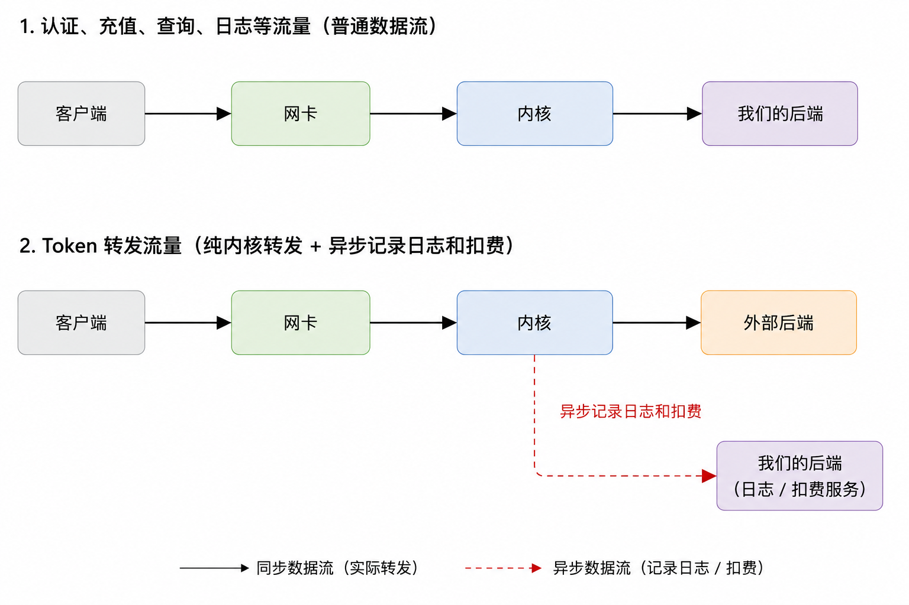

# MaaS 平台性能优化

我们最近在做一个 MaaS 平台的可行性分析，其中一个比较重要的问题是网关的性能。

一开始我们的设计比较普通。用户请求经过网关完成认证、额度检查和路由，然后由网关转发给实际的模型服务。模型返回的 streaming response 同样经过网关，再转发给用户。

这里有一个很明显的问题：认证、充值这些业务接口确实需要进入用户态处理，但是模型返回的 token 流量大部分时候只是单纯地经过网关。对于这种流量，网关实际上没有必要把数据从内核复制到自己的内存里，处理完之后再写回内核。

顺着这个问题，我们对比了一下 Nginx 和 HAProxy 的数据路径：


传统的 Nginx 转发中，数据需要从内核进入用户态，再从用户态回到内核。这里的 memory copy 不只是多占了一点内存带宽，它还需要 CPU 参与，同时会占用 CPU cache。

HAProxy 则存在另一条值得注意的数据路径：对于只需要转发的数据，可以利用 Linux 提供的内核能力，让数据尽量直接在内核中完成转发。用户态仍然可以处理连接建立、路由、日志等工作，但是不再需要为了“搬一下数据”而反复参与整个 token stream。

所以我们进一步把 MaaS 的流量拆成了两类：



认证、充值、额度查询这些业务流量还是正常进入用户态，因为我们确实需要理解和处理它们。

但是模型生成的 token 流量不一样。MaaS 在这段路径里很多时候只是一个中间人，如果不需要修改 payload，那么最理想的状态就是让它尽量直接转发，同时把日志、计量、扣费这些工作从同步的数据路径里拆出去。

这里并不是要把整个 MaaS Gateway 搬进内核，而是把“业务处理”和“单纯搬数据”拆开。

做到这里之后，又自然出现了两个问题。

**第一个问题是纵向的：如果我们真的要自己实现这样一个数据路径，Linux 到底提供了哪些能力供我们实现它？**

我们一开始接触到的是 `splice`，它允许数据在 fd 之间移动而不需要先 copy 到用户态。另外我之前也接触过 eBPF，它同样可以在 Linux 网络路径中做很多事情。继续往下看还会遇到 `sendfile`、`epoll`、`io_uring`、Socket Map、XDP、AF_XDP 等一系列机制。

这些东西看起来都和“高性能网络”有关，但是它们解决的问题其实并不一样。所以在决定具体实现之前，需要先把 Linux 这套 I/O 和网络机制弄清楚：它们最初为什么被设计出来，处在数据路径的哪一层，通常解决什么问题，以及放到 MaaS 这个场景里到底有没有意义。

**第二个问题是横向的：除了 token 流量做成内核态转发，还能横向扩展出其他思路吗？**

一次请求还会经过 TLS、鉴权、额度检查、路由、上游连接、日志、计费等很多环节。沿着“哪些工作其实没有必要出现在同步数据路径里”这个思路继续往外看，应该还能找到其他可以优化的地方。

所以接下来其实是两条线同时往下走：一条继续研究这个内核转发路径到底应该怎么实现，另一条重新检查整个 MaaS 请求链路还有哪些可以拿掉的同步成本。

而这两条线最后又汇聚到了同一个前置问题：先把 Linux 给高性能 I/O 和网络转发提供的这些底层机制搞清楚。

## 基础心智模型

由于此前很少直接接触过 Linux 的 system call、系统机制等，这里可能要补一些常识，来搭建一个最基本的心智模型。

**epoll** 是一种针对文件描述符（fd）的 I/O 事件订阅和消费机制，应用订阅关心的fd，之后只需等待该fd就绪然后消费即可，而不需要轮询fd，文件描述符用来抽象内核资源，比如普通文件、网络连接和管道等。

```c
int epfd = epoll_create1(0);

struct epoll_event event = {
    .events = EPOLLIN,
    .data.fd = listen_fd,
};

// 订阅 listen_fd 的可读事件
epoll_ctl(epfd, EPOLL_CTL_ADD, listen_fd, &event);

struct epoll_event events[1024];

while (1) {
    // 没有事件时线程会在这里休眠，不需要轮询 fd
    int count = epoll_wait(epfd, events, 1024, -1);

    for (int i = 0; i < count; i++) {
        int fd = events[i].data.fd;

        if (fd == listen_fd) {
            int client_fd = accept(listen_fd, NULL, NULL);

            struct epoll_event client_event = {
                .events = EPOLLIN,
                .data.fd = client_fd,
            };

            // 订阅新建网络连接的可读事件
            epoll_ctl(epfd, EPOLL_CTL_ADD, client_fd, &client_event);
        } else {
            // 消费 fd 就绪事件
            handle_request(fd);
        }
    }
}
```

**io_uring** 是内核中IO操作的队列机制，他提供了两个队列，一个用于发起任务，一个用于读取任务结果。 io_uring 主要提供两个作用，一个是有可能通过批量处理任务队列来优化性能，另一个作用是方便统一管理IO操作。

内核的 **eBPF** 机制允许用户提供一段代码在内核态运行，这样可以显著提高执行效率，但是这段代码必须经过验证器的检查，确保它是安全的，并且它能够访问的内存以及可使用的内核API接口都是受限的。

> **Socket** 是内核对网络通信端点的抽象，这种抽象并不绑定某一种具体协议，既可以用于 TCP，也可以用于 UDP。应用调用 `socket()` 在内核中创建一个 Socket，并通过调用参数指定协议族和通信类型，内核随后返回引用它的文件描述符。客户端可以调用 `connect()` 让 TCP Socket 与服务端建立连接；服务端则先通过 `bind()` 绑定本地 IP 和端口，再调用 `listen()` 把它变成监听 Socket。当连接到来时，`accept()` 会返回一个新的 Socket，原来的监听 Socket 继续等待其他连接。
>
> 连接建立后，应用通过 `send()` 和 `recv()` 向 Socket 发送和读取数据，数据实际先进入内核为该 Socket 维护的发送或接收缓冲区，再由 TCP/IP 协议栈处理。`shutdown()` 用于关闭连接的发送或接收方向，`close()` 则用于释放当前进程对 Socket 的引用。因此 Socket 并不只是一个“网络连接”，而是内核维护的通信状态、缓冲区和协议行为的集合，应用通过 fd 和上述 API 操作它。

eBPF 可以通过 **Socket Map** 实现与 `splice` 类似的功能。Map 也是一种内核资源，用户态程序通过文件描述符访问它，eBPF 程序则通过 Map 引用和内核允许的 helper 访问它。eBPF 程序的局部状态会随每次调用结束而消失，因此 Map 的一个重要作用就是在多次调用之间保存和共享状态，这些数据同时也可以被用户态程序访问。

Socket Map 是一种可以引用 Socket 的 eBPF Map。用户态程序在完成连接建立、认证和路由之后，可以将相关 Socket 放入 Socket Map，再由 eBPF 程序在 Socket 之间直接于内核态重定向消息。它与 `splice` 的区别在于，`splice` 需要用户态程序在收到 I/O 就绪通知后，主动调用 `splice` 完成每次搬运；Socket Map 则允许配置好的后续转发由 eBPF 在内核数据路径中触发，不再需要用户态程序为每次搬运反复参与。

网络包进入 Linux 后，通常会经过由以太网、IP、TCP/UDP、路由和过滤等功能共同构成的内核网络协议栈，最后才会到达 Socket。在这条路径上，**skb** 是 Socket Buffer 的缩写，对应 Linux 内核中用于表示网络包的 `struct sk_buff`。这里的 Buffer 不是简单的缓冲区的意思，实际上是类似DTO的数据传输模型，一个真实的网络包通常需要先在内核中建立对应的 skb，才能继续进入常规网络协议栈处理，skb 相当于网络包进入 Linux 网络技术栈的第一步。

然而，还有一个机制的执行位置比 skb 的建立更早，那就是 **XDP**。

XDP 是位于网卡驱动收包路径上的 eBPF 执行点，它能够在网络包进入 skb 和常规协议栈之前，直接决定放行、丢弃、发回或重定向，因此适合尽早处理那些只依赖原始网络包信息的工作。这有点类似于中间件提前拒绝超过限流阈值的请求，只不过 XDP 处理得更早，丢弃的是尚未进入常规协议栈的网络包，而不是已经解析出来的应用层请求。

到这里我们可以发现，ebpf程序后端中间件是非常相似的，可以实现诸多防护、限流、观测和转发功能。


另有一个 **AF_XDP** 是一种面向高性能包处理的 Socket。XDP 可以把网卡收到的原始网络包重定向到 AF_XDP，让用户态程序不经过常规 skb、网络协议栈和普通 Socket 路径，直接收发网络包。不过对我们的场景意义不大。

至此我们可以建立一个简单的 Linux 网络技术栈的心智模型。

## 一些 JS 不方便使用的 Linux 机制

除了前面提到的机制，Linux 还提供了一些可能对 MaaS 网关有用的优化能力，但它们离 Node.js 和 NestJS 的应用层比较远，并不一定能够在 JS 中直接使用。

**kTLS** 允许用户态 TLS 库完成握手、证书校验和密钥协商后，将密钥和会话参数交给内核，由内核处理后续 TLS Record 的加密、解密和收发。这不是把完整的 HTTPS 逻辑搬进内核，而是将建立连接后高频的对称加解密下沉到更合适的数据路径中。但 Node.js 的 TLS 由 OpenSSL 实现，要使用 kTLS 同时取决于 Linux、OpenSSL 的编译选项和运行时配置，NestJS 并没有直接开启它的常规接口。

**SO_REUSEPORT** 允许多个 Socket 绑定同一个 IP 和端口，再由内核把新连接分配给不同的监听 Socket，从而让多个进程分别利用不同 CPU 核心。Node.js 的底层 `net.Server` 已经提供 `reusePort` 选项，但 NestJS 通用的 `app.listen()` 并没有直接暴露它。实际部署中，通常会改用 Node cluster、多个容器或多个 Kubernetes Pod 来解决同一个多核利用问题。

类似的机制还包括将收包处理分散到多个 CPU 的 RSS/RPS，在小包延迟和吞吐之间取舍的 `TCP_NODELAY`、`TCP_CORK` 和 `MSG_MORE`，以及用于减少大块数据发送拷贝的 `SO_ZEROCOPY`。它们有的由 Node.js 间接封装，有的需要在操作系统、网卡或部署层配置，并不都适合在 NestJS 的业务代码中直接控制。

实际上，Node.js 在 Linux 上通过 libuv 使用 epoll，因此没有 JS API 不代表底层没有利用 Linux 机制。但 `splice`、Socket Map、XDP 和 kTLS 等更深的数据路径能力确实超出了 NestJS 常规 API 的范围。如果它们对性能至关重要，就需要通过 Native Addon、独立代理、eBPF agent 或其他数据面组件实现，而 NestJS 更适合继续承担鉴权、额度、路由和计费等业务控制工作。

至此，我们可以先回答文章开头的横向问题：除了 token 流量做成内核态转发，还能横向扩展出其他思路吗？思路是有的，就是这里提到的这个KTS和多核处理同一端口，但是由于 nestjs 的抽象层级过高，想要在 nestjs 中使用它们可能成本不低。


## 实验

这一节我们开始回答纵向问题，如何在 nestjs 实现背景提到的数据路径。我大致思路是使用 Golang 开发 ebpf 程序供 nestjs 使用。