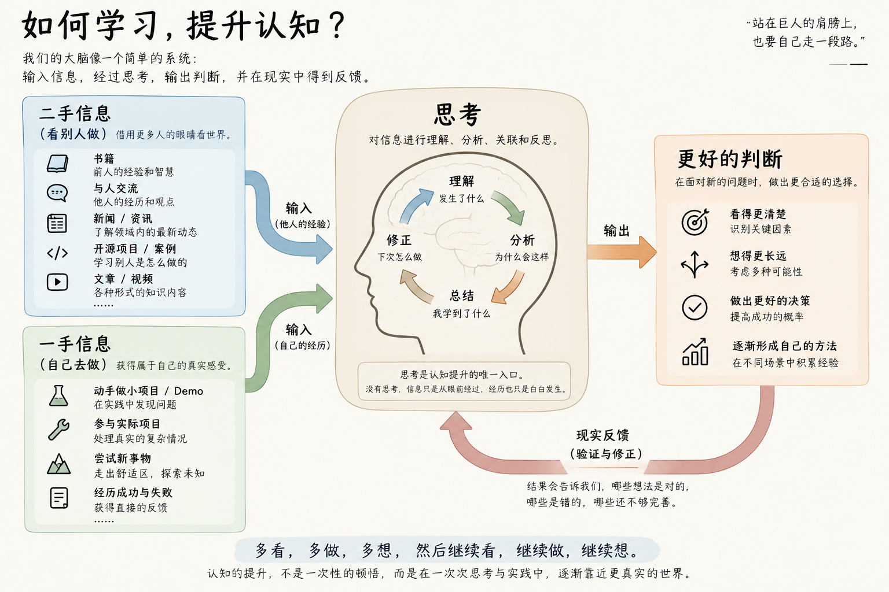

# 所谓认知，到底是怎么来的？

我经常在和别人聊一些金钱、时间、工作、机会等话题的时候，发现有的人会有更智慧的理解，我尝试去理解这是为什么，最后发现这些道理其实我们从小就学过。

此时可能会有人说，人生是自己的，想怎么过就怎么过，这些话题太功利、太成功学了。我想用一个自然段简单的反驳一下这种声音，每个人当然可以用自己喜欢的方式度过人生，聊这些话题并非是我被成功学洗脑，而是我确认这些话题是我真正在乎的，我多少是一个有一些事业心的人。我们首先认为有无事业心的人都值得尊重，然后再谦卑地对没有事业心的读者道歉：我已经尽我所能地避免让您接触到本文这样的您不喜欢的内容，但难以保证万无一失，如果这不是您想要阅读的内容，我深感抱歉，我们接下来要进行事业心的讨论，为了避免进一步浪费您宝贵的时间，您现在可以退出了，这条抱歉适用于所有不喜欢这段开头的读者。

## 认知水平差异

结束了免责声明之后，让我们来具体说明一下什么叫做“有的人会有更智慧的理解”，其实用成功学的话来讲就是 “有更高的认知”，或者没那么成功学但是程序员的技术世界会聊的“有更高的判断力” （毕竟有了AI之后我们发现程序员，包括未来其他被ai cover的其他职业，只剩判断力比较保值了），或者我更倾向于用一个既贴切、又更容易承认的类比：“有更高的游戏理解”，尤其是 fps 游戏玩家，不得不承认，有的人确实有更高的游戏理解。

本小节主要目的是让读者承认，人和人之间的认知水平，或者判断力，或者对地球online的游戏理解，确实是有差异的，当然我们也要承认不同领域之间的判断力是无法迁移的，就比如我虽然可能对软件工程有不错的判断力，但如果你要问我做某道菜的时候要不要加水我就一窍不通了，所以我更愿意用游戏理解这个词，不同游戏之间的理解也是无法迁移的。

本文不是在讲某特定领域内的经验和见识，而是想要去思考“认知到底是什么东西，如何去提升”，所以才需要首先让读者承认，人的认知有差异，并且难以跨领域迁移 —— 至少有些部分不能迁移，少部分是可以迁移的。

按理来讲一个好的作者应该在此处做出许多论证，就像高中学到的议论文写法，但是我实在想不到这还怎么需要证明，我觉得用游戏理解来类比，就足够读者认同了，大部分人应该都知道自己和高水平玩家之间的游戏理解差异，如果你不是游戏玩家或者还需要我补充的话可以联系我添加证明材料（笑）。为了上下文衔接和逻辑连贯性，我们必须先在文章里去证明认知是有差异的，但具体证明过程留给读者当做课后练习作业吧。

## 如何提升

懒得引导读者、论证我的思考过程了，其实我是先和chatgpt讨论了很多才有了思考结论才有了这篇博客，补充中间的思考过程其实是挺痛苦的事情。直接说出我的思考结果：

我们平时就在处理各种日常信息，我们的大脑可以当做一个简单的 输入、处理、输出的系统，我们可以说不同的认知水平的人，面对相同的输入可以得到不同质量的输出，问题在于如何提升认知水平来提升输出的质量 —— 这很能让人自然而然的联想到 LLM。

无非就是靠学习来提升认知水平，或者我们说句爆的，学习这个词被发明出来，就是用来概括 “提升认知水平”的过程。如何提升认知水平这个问题就变成了如何学习。

你知道的，我们有五千年的历史：

```bash
“学而不思则罔，思而不学则殆。”

“纸上得来终觉浅，绝知此事要躬行。”

“读万卷书，行万里路。”

“实践出真知。”

“吃一堑，长一智。”

“三人行，必有我师焉。”

“兼听则明，偏信则暗。”

“温故而知新。”

“吾日三省吾身。”

“见贤思齐焉，见不贤而内自省也。”

“博学之，审问之，慎思之，明辨之，笃行之。”

“知之者不如好之者，好之者不如乐之者。”

“活到老，学到老。”

```

还有一些已经老生常谈到我们几乎不会认真去想的话：

```bash
多读书。

多出去走走。

多和不同的人交流。

多尝试新鲜事物。

不要闭门造车。

不要纸上谈兵。

失败了要总结经验。

不要在同一个地方跌倒两次。

保持好奇心。

保持终身学习。
```

那么这篇文章距离完成就只剩下最后一件事，结合一下历史智慧和我们个人的感悟，来总结一下“如何学习”：



其实都是老生常谈的东西，至于如何去做到这些事，如何理解这些事，如何看待学习，同样也是认知的一部分，需要读者去进行大量的思考。