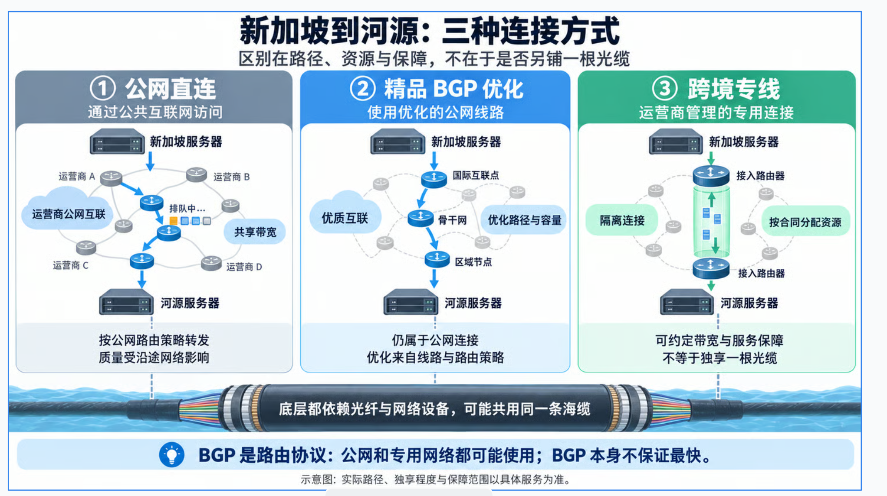
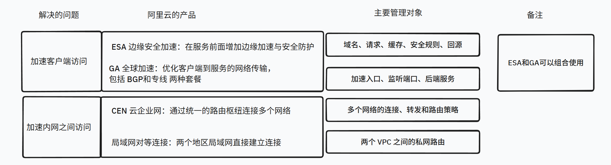
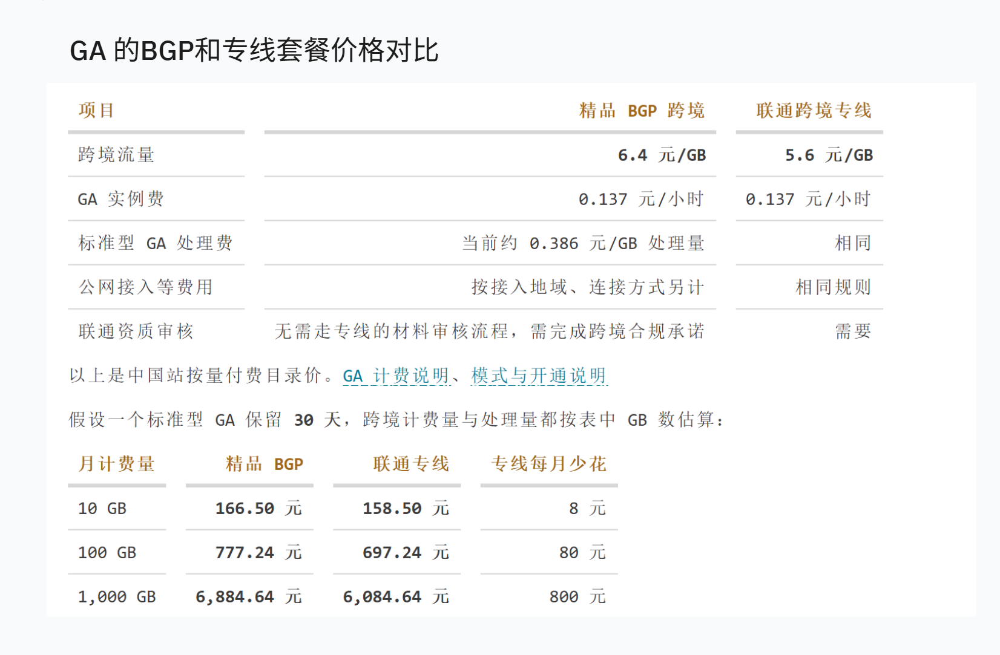

# 跨境专线和bgp

我一直都听说过BGP，但是不清楚具体是什么东西，这次遇到一个需要国外服务器访问国内服务器的情况，正好遇到了BGP，讲一下是怎么回事。

第一个问题是，跨境连接到底有哪些方式，可以先分成公网连接和跨境专用连接。常听到的“精品 BGP”属于优化的公网连接，而 BGP 本身是路由协议，下图解释了它们的区别：



直连、BGP、专线，可能在物理上都是相通的光缆，但是运营商可能由于合同而承诺给一些公司提供更优质的网络资源，这就是专线。


## BGP

BGP 的全称是 Border Gateway Protocol，边界网关协议。它主要解决一个问题：互联网由很多独立管理的网络组成，这些网络怎么知道去某个 IP 地址该往哪里走？

这里先引入一个概念，自治系统，简称 AS。可以把它理解为一组按照统一路由策略管理的网络。运营商、云厂商等机构会管理自己的 AS，一个机构也可能拥有多个 AS。

BGP 就是这些网络交换路由信息的协议。一个网络告诉邻居：“这段 IP 地址可以经过我到达。”邻居再根据策略，把这条信息继续告诉其他网络。通告中还会记录经过哪些 AS，用于选路和避免环路。路由器据此选择路由，再按路由表转发业务数据。[协议定义见 RFC 4271](https://www.rfc-editor.org/rfc/rfc4271)。

### BGP 会自动选择最快的路线吗

不一定。假设新加坡服务器所在的网络收到了两条去往目标网段的路由：

```text
路线一：本地网络 → 运营商 A → 目标网络
路线二：本地网络 → 运营商 B → 运营商 C → 目标网络
```

路线一经过的网络少，但不代表延迟一定更低；而且实际选路时，运营商配置的优先级可能比经过多少个 AS 更重要。例如，一条线路价格便宜，运营商就可能优先使用它。

所以，BGP 所谓的“最佳路由”，是按照路由策略选出来的，并不是实时测一遍所有路径、选出延迟最低的那条。线路故障后，相关路由可以被撤回，再选择可用的替代路由，但切换也需要时间。[选路过程见 RFC 4271 第 9 节](https://www.rfc-editor.org/rfc/rfc4271#section-9)。

### 那为什么云厂商会卖“精品 BGP”

普通公网本来就在使用 BGP。购买“精品 BGP”，买到的是服务商提供的更优质的线路、互联资源和路由策略，不是一个付费版的 BGP 协议。比如阿里云就把普通 BGP 多线与 BGP 精品线路作为不同的公网质量类型提供，具体优化范围取决于产品和地域。[阿里云的线路说明](https://help.aliyun.com/zh/ga/user-guide/overview-of-standard-ga-instances/)。

这也解释了为什么不能严格地把 BGP 和专线并列：前者是路由协议，后者是连接服务。专用网络也可以使用 BGP，比如运营商的 BGP/MPLS VPN 就用 BGP 分发客户网络的路由，同时在共享骨干网上隔离不同客户的流量。[相关标准见 RFC 4364](https://www.rfc-editor.org/rfc/rfc4364)。


## 产品层

具体到如何使用 BGP 和专线，我们可以了解一下阿里云的具体关系到跨境的产品：



对于我的场景，我需要的是GA。

GA下面分BGP和专线，下图是价格对比


