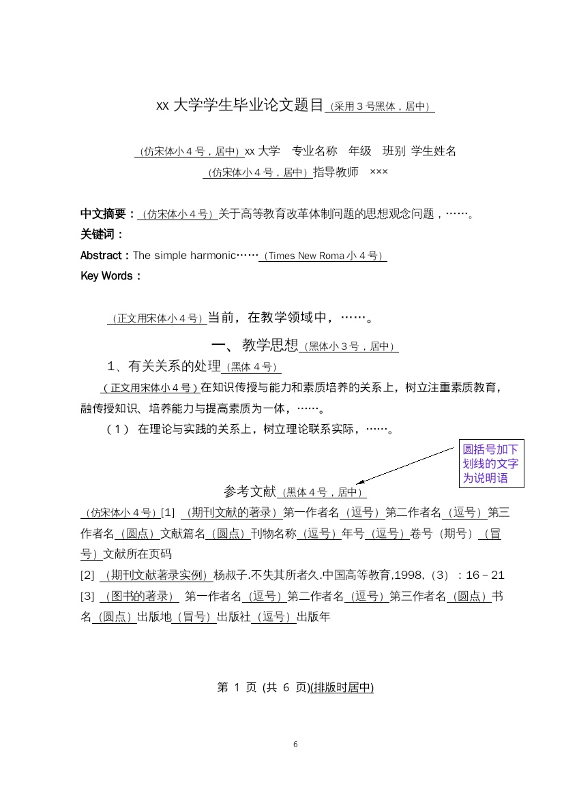

# 开发者如何使用Office

我一直很不喜欢用Office，并且正在向纯键盘操作的方向努力。但是总有某些时候需要用Office，比如我最近需要写开题报告。我打算记录一些用法，供自己阅读。

## markdown转word

编辑内容必然是用markdown，用你喜欢的编辑器即可。然后把markdown转换成docx，有很多种方法，我尝试过这些：

1. 通过office word mcp，让AI一句一句把markdown按照格式插入到docx
2. 用python解析markdown，一边调整格式一边输出到docx
3. 用pandoc把markdown转docx，然后手动调整格式。

这三个方法我都简单尝试了：

1. 第一个方法行不通的原因是office word mcp似乎并不支持复杂的office样式设置，而且AI也并没有想象的那么听话（GLM 4.7）。
2. 第二个不行的原因有两方面，一方面有些markdown内容本身就不怎么符合内容规范，转换成docx还是不符合的；另一方面有些markdown语法未必能很好的在docx中找到完全符合的映射， 或者某个语法有多种用法（比如超链接），不仅要识别语法，还要根据不同的用法进行映射，复杂度有点太高了。完全程序化是行不通的，至少需要借助一部分AI或者人力。
3. 第三个方式安装pandoc之后很容易就可以把markdown转换成docx。

> 实际上结合一下前两个方法，还有一种方法是可行的，AI的主要问题是无法进行debug，完全程序化方法又需要一部分随机应变，那么我们可以创建一个skill，让AI根据内容规范尝试创建python脚本进行转换，然后把转换结果渲染成图片让AI检查，这样AI就可以检查docx是否符合学校或者公司的规范要求，最终AI应该可以输出一个90%可用的、专门针对某组织文档要求的 markdown转word。
>
> 之所以判断为90%可用，是因为我之前做过一个pdf转markdown的skill，使用过类似的把pdf渲染成图片方式，好让AI理解pdf的排版，在GLM 4.6上的效果还不错。
>
> 但是对于我眼前的需求，我并没有太多时间来做这个skill。

下面尝试延续第三种方法手动调整内容规范。

## 手调 word 格式

比如我的学校格式要求如下

